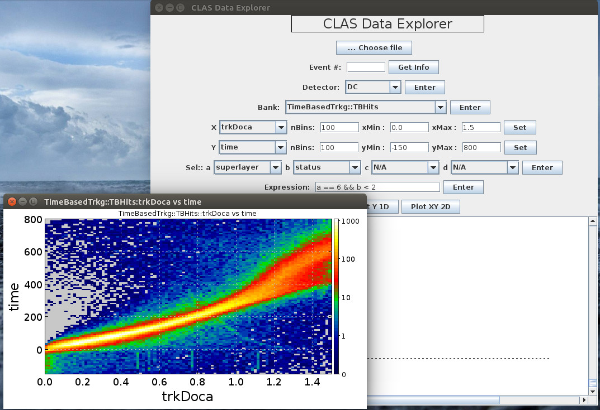

CLAS12 Data Explorer
=======================

Features
----------

 - Make plot of any variable/channel from any bank from any detector sub-system with few clicks 
 - Look at actual numbers of desired event
 - Look into the data from different perspectives
 - Make 1D or 2D histogram of desired variables
 - Apply cut using up to four variables.


Give it a try before you download
-----------------------------------
You can give it a try from ifram by issuing the following command:
```
java -jar /volatile/clas12/latif/DataExplorer.jar
```

Dependencies
--------------

 - CoatJava
 - Jackson
 - Clas12lib

The jar files for each of the above packages are stored inside the ```lib/``` directory. You need to add them to the ```Build Path``` before you can compile the DataExplorer. You are free to replace CoatJava jar with your own copy.

Compilation Instructions
------------------------

1. Download/clone the ```DataExplorer package```
2. From your IDE export the package as new project.
3. Add jars for ```CoatJava, Jackson, Clas12lib``` to your build path.
4. Modify the file ```src/*/Constants.java``` to set correct default data path for your system.
5. From Eclipse export to runnable jar

How to use
----------

Check the presentation 

**Note:**
- In the run number field, the systax is ```RunNumber:FileNumber```
- In the cut expression box, you must enter a logical expression. 


**Screenshot**

